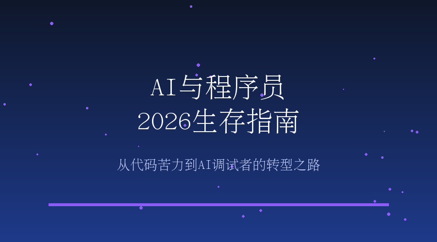

# AI与程序员：2026生存指南

## 引言：一个时代的终结

2025年12月，一条消息在开发者圈子里炸开了锅：Anthropic的AI编程工具Claude Code上线仅仅6个月，就创下了近10亿美元的年化营收。与此同时，GitHub Copilot的用户数突破1500万，比前一年增长了4倍。

这些数字背后，是一个正在被重塑的行业。Stack Overflow 2025年的调查显示，65%的开发者已经每周使用AI编程工具。但另一组数据却让人警醒：66%的程序员反映，修复AI生成代码的bug比自己从头写还要耗时。

这不是简单的"AI取代人类"的叙事，而是一场更深层次的职业转型。2026年，我们正在见证"代码苦力之死"——程序员的角色正在从"写代码的人"转变为"调试AI代码的人"。

## 一、AI编程的爆发式增长

### 数据背后的真相

先让我们看几组震撼的数据：

**商业化速度史无前例**：Claude Code在6个月内达到10亿美元年化营收，这不仅是AI编程工具的纪录，在整个SaaS历史上也极其罕见。资本市场用真金白银投票，证明AI编程不是一个噱头。

**用户采用率飙升**：GitHub Copilot从400万用户增长到1500万，只用了一年时间。更值得注意的是，这些用户中大多数是付费订阅——开发者愿意为能提升效率的工具掏钱。

**代码产出激增**：根据GitHub的内部数据，使用Copilot的开发者编写的代码中，有41%是由AI生成的。在某些项目中，这个比例甚至更高。

### 但现实并不像数据那么美好

然而，硬币的另一面同样值得关注。

Stack Overflow的调查揭示了一个矛盾现象：虽然84%的开发者已将AI纳入工作流，但对AI的好感度却在罕见地暴跌。为什么？

**"氛围编程"的陷阱**：2025年被选为年度词汇的"氛围编程"（Atmospheric Coding），指的是开发者使用AI生成代码后，并不真正理解代码逻辑。这种做法看似提升了效率，实则埋下了巨大的技术债务。

**调试成本被低估**：66%的程序员发现，当AI生成的代码出现bug时，修复时间比自己从头写还要长。原因很简单——你不熟悉的代码，调试起来就是地狱。

## 二、2026：转折点之年

谷歌DeepMind在2025年底做出预测：2026年将成为AI编程的关键转折点。这一年将发生什么？

### 从辅助到主导

2025年，AI还是"助手"；2026年，AI将成为"主力开发者"。

最新的AI编程agent已经可以完成77%的复杂任务（这个数字在2025年初还不到50%）。它们不仅能写函数，还能：

- 理解整个项目的代码结构
- 根据产品需求生成完整功能模块
- 自动运行测试并修复失败的用例
- 优化性能和重构代码

### 新的工作流程

2026年的开发流程可能是这样的：

1. 产品经理提出需求
2. AI agent分析需求并生成技术方案
3. AI编写代码并自动测试
4. 人类review代码并调试AI无法解决的问题
5. AI根据反馈迭代优化

注意到了吗？人类的角色从"编写者"变成了"审核者"和"调试者"。

## 三、程序员如何应对这场变革

### 危险的信号：大厂裁员潮

2025年年底，亚马逊宣布削减1.4万个岗位。虽然官方没有直接说明与AI相关，但坊间普遍认为，AI编程工具的普及是重要因素之一。

这不是危言耸听。当AI可以完成初级程序员80%的工作时，公司自然会重新评估团队结构。

### 生存策略：转型而非抵抗

面对这场变革，程序员应该如何应对？

#### 1. 掌握AI工具，而不是拒绝它们

这是最基本的要求。你应该熟练使用至少2-3种AI编程工具：

- **Claude Code**：擅长复杂任务和长上下文理解
- **GitHub Copilot**：IDE集成度高，适合日常编码
- **Cursor**：优秀的代码理解和生成能力

更重要的是，要了解每个工具的优缺点，知道在什么场景下使用哪个工具。

#### 2. 从"写代码"转向"设计系统"

AI可以写出完美的函数，但它不擅长：

- 理解业务需求和用户体验
- 设计系统架构和数据模型
- 做技术选型和权衡决策
- 处理边缘case和异常流程

这些是人类的护城河。2026年及以后的资深程序员，核心竞争力不是写代码的速度，而是：

- 系统设计能力
- 业务理解能力
- 问题分析和拆解能力
- 技术决策能力

#### 3. 成为"AI调试专家"

这是一个新出现的角色定位。当AI生成大规模代码时，必然会出现：

- 逻辑错误但语法正确的代码
- 性能问题
- 安全漏洞
- 与业务需求不匹配的实现

谁能快速定位和修复这些问题，谁就不可或缺。

#### 4. 深耕特定领域

通用编程能力正在被AI commoditize，但领域专业知识依然稀缺：

- 金融科技：理解监管要求、风控逻辑
- 医疗健康：熟悉HIPAA、数据隐私
- 游戏开发：掌握引擎、物理系统、AI行为树
- 嵌入式系统：了解硬件限制、实时性要求

AI可以帮你写代码，但它无法替代你对行业的深度理解。

#### 5. 提升软技能

当AI承担了更多技术工作时，人类的差异化优势在于：

- 与产品经理沟通需求的能力
- 向非技术人员解释技术方案的能力
- 团队协作和项目管理能力
- 持续学习和适应变化的能力

## 四、2030年的程序员会是什么样？

DeepMind预测，2030年将实现全自动编程。那时的程序员会是什么样子？

### 可能的场景

**场景A：悲观版**
- 大部分初级开发岗位消失
- 只有极少数"架构师"和"AI训练师"幸存
- 编程成为小众技能

**场景B：乐观版**
- 程序员从重复劳动中解放出来
- 专注于创意、设计和业务价值
- 每个人都能通过AI构建软件

现实可能介于两者之间。一种新的职业形态正在浮现：

**"产品工程师"**：既懂产品又懂技术，能用AI快速将想法变成原型，然后根据用户反馈迭代。

### 长期建议

为了在2030年依然具备竞争力，从现在开始：

1. **培养产品思维**：理解你写的代码为谁创造什么价值
2. **学习AI原理**：至少了解LLM是如何工作的
3. **保持技术广度**：不被单一技术栈束缚
4. **建立个人品牌**：在特定领域建立影响力

## 五、给不同阶段程序员的建议

### 初级程序员（0-3年）

你最危险，但也最有机会转型。

- **不要只满足于"能跑就行"**：AI生成的代码通常"能跑"，但你需要理解它为什么能跑
- **找一位愿意指导你的senior**：在AI时代，人类导师的价值反而提升了
- **专注于某个领域**：不要成为"什么都会一点"的全栈，要成为"某个领域深耕"的专家

### 中级程序员（3-7年）

你是转型的关键群体。

- **评估自己的核心竞争力**：如果AI能做你80%的工作，你需要找到那20%的差异化
- **提升系统设计能力**：这是AI目前最薄弱的环节
- **学习prompt engineering**：掌握如何让AI生成更好的代码

### 资深程序员/架构师（7年+）

你相对安全，但需要拥抱变化。

- **成为AI工具的布道者**：帮助团队更好地使用AI
- **专注于复杂问题**：那些AI无法自动解决的问题
- **培养下一代**：教会他们如何与AI协作，而不是被AI取代

## 六、具体行动指南

### 立即可以做的事

**本周**：
- 尝试至少一种AI编程工具（如果还没用过）
- 用AI重构你项目中的一个模块
- 思考你的工作中哪些部分最容易被AI替代

**本月**：
- 深入学习你主要使用的AI工具的高级功能
- 读一本关于AI编程的书籍或系统课程
- 和团队讨论如何更好地集成AI到工作流中

**本季度**：
- 选择一个垂直领域开始深耕
- 建立自己的AI辅助开发工作流
- 在社交媒体或技术社区分享你的AI编程经验

### 长期投资

- **学习AI/ML基础**：即使不从事AI开发，理解原理也能帮你更好地使用工具
- **提升英语能力**：大部分AI文档和社区讨论是英文的
- **建立个人项目**：AI让独立开发变得更容易，这是展示能力的好机会

## 总结：危机还是机遇？

AI对编程的影响是革命性的，这既是危机，也是机遇。

**危机**在于：如果你的核心竞争力只是"写代码的速度"，那么你确实在危险之中。AI比你快、比你便宜、24小时不休息。

**机遇**在于：AI正在降低编程的门槛，让更多人能够将想法变成现实。对于有创造力、有产品思维、有领域专业知识的人来说，这是一个黄金时代。

2026年，我们不需要更多的"代码搬运工"，我们需要的是：

- 能理解用户需求的产品工程师
- 能设计优雅系统的架构师
- 能快速定位问题的调试专家
- 能将AI工具发挥到极致的实践者

这场变革不是AI取代人类，而是会用AI的人取代不会用AI的人。

你准备好了吗？

---

**延伸阅读**：
- GitHub Copilot官方文档：https://docs.github.com/en/copilot
- Claude Code官方文档：https://docs.anthropic.com/
- Stack Overflow 2025开发者调查报告：https://survey.stackoverflow.co/2025/
