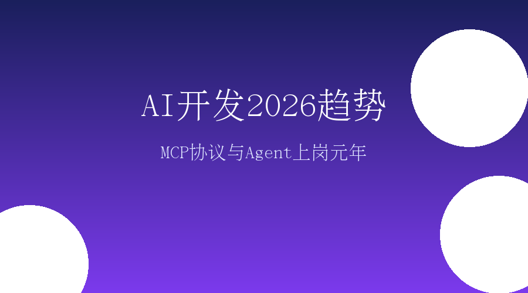

# AI开发2026趋势

## 引言：转折点已至

站在2026年1月10日回望过去两周，我们发现AI行业正在经历一场前所未有的质变。这不是关于哪家公司又融了多少钱，也不是哪个模型的参数又突破了多少——真正的变革在于AI正在从"炫技"走向"干活"。

2026年1月7日，微软宣布Windows 11原生支持MCP协议；1月8日，Claude Code 2.1一口气更新80+功能；智源研究院发布《2026十大AI技术趋势》；零一万物提出"企业Agent上岗元年"概念——这些事件密集发生，传递出一个明确信号：**2026年是AI规模化应用的拐点年**。

对于AI开发者和产品经理而言，这是一个必须重新思考职业方向和技能体系的时刻。

---

## 一、MCP协议：AI开发的USB-C接口

### 微软Windows 11原生支持

2026年1月7日，微软官方宣布Windows 11将全面升级"智能体开发"，原生支持MCP（Model Context Protocol）协议。

这个消息的份量远超表面看起来那么简单。就像USB-C接口统一了设备连接标准，MCP正在统一AI应用与外部系统的连接方式。微软的加入，标志着MCP从一个"有趣的实验项目"正式升级为"行业标准基础设施"。

### MCP到底是什么？

MCP是由Anthropic在2024年11月发布的开放标准协议，被称为"大模型AI-Agent的USB-C接口"。

它的核心价值在于解决一个长期困扰AI开发者的痛点：**数据孤岛与工具集成**。

在MCP出现之前，如果你想让AI Agent访问你的数据库、调用你的API、操作你的本地文件，你需要为每个数据源和工具编写专门的自定义代码。这种方式不仅开发成本高，而且难以维护。

MCP提供了一个统一的协议框架，让AI应用能够安全地访问和操作本地及远程数据，标准化地调用各种工具和服务。

### MCP开发最佳实践

根据最新实践总结，构建高质量MCP服务器的五个关键点：

1. **统一调度多渠道输入任务流**：设计清晰的请求路由机制
2. **ReAct框架进行推理+行动**：让Agent能够思考-观察-行动循环
3. **状态管理机制**：确保长期任务的上下文连贯性
4. **异步队列**：保证高并发下的稳定性
5. **安全边界设计**：明确Agent能做什么、不能做什么

---

## 二、Claude Code 2.1：AI编程进入成熟期

### 80+功能更新

2026年1月8日，Claude Code 2.1发布，一口气更新了80多个功能特性。这次更新的意义不在于功能的数量，而在于它**解决了一个长期困扰开发者的痛点——Skills自动热重载**。

在此之前，每次修改Skill都需要重启整个Claude Code。现在，Skills可以自动热重载，意味着开发效率的质变。

### 核心竞争力

Claude Code在以下几个方面建立了明显优势：

**持久记忆功能**：Claude Code能够记住项目的上下文、你的编码风格偏好、项目特定的约定。这种"越用越懂你"的能力，是传统IDE无法比拟的。

**并行处理能力**：Claude Code可以同时处理多个文件、多个任务，这在处理大型项目时尤其重要。

**长程任务稳定性**：根据测试，Claude Opus 4.5在自主编码任务中能够连续5小时不崩溃，这是迄今为止公开AI完成长程任务的最长记录。

### 商业表现

Claude Code上线仅6个月就创造了近10亿美元年化营收。更重要的是，Cursor推出的"动态上下文发现模式"能够平均降低46.9%的Token消耗。

这意味着AI编程工具不仅在变强，而且在变便宜。

---

## 三、推理模型DeepSeek R1

### 强化学习的突破

2026年1月，DeepSeek R1更新了一篇86页的论文，展示了如何通过强化学习显著提升AI推理能力。

核心发现：在数学、编程等需要深度推理的任务上，DeepSeek R1的表现能够与OpenAI o1持平甚至超越。

### 成本控制的艺术

DeepSeek R1的一个重要启示是：高性能不必然意味着高成本。通过优化的训练策略，DeepSeek在达到国际顶尖模型性能的同时，将训练成本控制在一个相对合理的水平。

这对国内AI开发者尤其重要——它证明了不依赖无限算力，也能做出有竞争力的模型。

---

## 四、2026：企业Agent上岗元年

### 从Demo到上岗

零一万物近期提出"2026是企业Agent上岗元年"的判断。这个判断的核心逻辑是：AI Agent正在从"演示项目"走向"生产环境"。

**2025年的状态**：企业部署了100个Agent Demo，其中95%停留在试点阶段
**2026年的目标**：企业开始将Agent真正部署到生产环境，取代或增强实际工作岗位

### 上岗的四个硬指标

要让Agent真正"上岗"，必须满足以下四个条件：

**（1）输出正确度**：Agent的输出必须达到或接近人类专家的水平

**（2）可解释性**：当Agent做出决策时，能够解释"为什么这么做"

**（3）偏好一致性**：Agent的行为必须符合企业的价值观和业务规则

**（4）安全性**：不能出现敏感数据泄露、错误操作等安全问题

### 评估工程的兴起

2026年1月，阿里云提出"评估工程正成为下一轮Agent演进的重点"。这意味着企业需要建立系统化的Agent评估体系，而不是凭感觉判断好坏。

火山引擎在2025年12月发布了国内首个企业级AI Agent应用评估标准。

---

## 五、AI产品经理的新命题

### 商业闭环的挑战

近期一篇深度文章指出了AI产品经理面临的核心挑战：**如何在控制推理成本的同时，提供足够好的用户体验，最终实现盈利？**

这不是一个技术问题，而是一个商业模式设计问题。

### 三大核心能力

AI时代的产品经理需要具备：

**（1）大模型技术理解能力**：理解不同模型的能力边界、什么场景适合用哪种模型、Token成本如何影响商业模式

**（2）行业领域知识**：深入理解行业的真实痛点和AI能够带来的独特价值

**（3）商业化思维**：设计清晰的收费模式、计算客户ROI、找到PMF

### B端产品的ROI计算逻辑

对于面向企业的AI产品，产品经理必须能够回答：**"用你的AI产品，比用人工，能省多少钱？"**

比如：一个工业检测AI系统，成本不能超过人工检测成本的60%，否则客户没有动力采用。

---

## 六、AI编程工具全景对比

| 工具 | 核心优势 | 适用场景 | 定位 |
|------|----------|----------|------|
| **Trae** | 设计稿直出代码 | UI开发、前端项目 | 全场景AI原生IDE |
| **Claude Code** | 命令行全栈开发 | 后端、全栈项目 | 终端AI编程 |
| **GitHub Copilot** | 生态完善、多语言 | 日常编码 | 传统IDE内辅助 |
| **Cursor** | 专家级重构能力 | 代码重构、大型项目 | 重构利器 |
| **Amazon CodeWhisperer** | 免费云原生 | AWS生态项目 | 免费入门选择 |

2026年，"免费AI编程助手"成为趋势。多个平台开始提供免费版本，降低了开发者的尝试门槛。

---

## 七、技术趋势：从参数到应用

智源研究院在2026年1月8日发布的报告中明确提出：**AI演进的核心从参数规模转向实际应用**。

**2023-2024年的逻辑**：谁的模型参数多，谁就厉害
**2026年的逻辑**：谁的应用真正落地、创造价值，谁就厉害

智源还提出：闭环进化能力将成为企业竞争的关键。就是AI系统能够从实际使用中不断学习和改进，形成"使用-反馈-优化"的闭环。

---

## 八、给AI开发者的建议

### 技术栈选择

**AI Agent开发**：
- **MCP协议**：必须掌握，这是行业标准
- **LangGraph**：复杂工作流编排
- **CrewAI**：多Agent协作

**RAG应用开发**：
- **LlamaIndex**：文档处理
- **向量数据库**：Milvus、Zilliz Cloud

**编程辅助**：
- **Claude Code**：命令行全栈
- **GitHub Copilot**：IDE内辅助

### 避坑指南

**不要做的**：
- 追逐每一个"最新发布"的模型
- 试图用AI解决所有问题
- 忽视评估和监控

**应该做的**：
- 选择成熟稳定的技术栈
- 聚焦具体业务场景
- 建立科学的评估体系

---

## 九、给AI产品经理的建议

### 找PMF的三步法

**第一步：找到真实痛点**——不要问"我们能做什么"，要问"用户真正需要什么"

**第二步：设计可验证的MVP**——用最小的成本验证核心假设

**第三步：快速迭代**——基于数据而不是感觉做决策

### 商业模式设计要点

**成本控制**：理解不同模型的Token成本，设计智能的缓存策略
**定价策略**：B端基于ROI定价，C端基于价值感知定价
**增长策略**：聚焦垂直场景做深做透

---

## 总结：行动起来

2026年1月的这些密集变化，传递出一个明确的信号：**AI正在从"技术驱动"转向"应用驱动"**。

对于AI开发者来说，这意味着不再需要追逐每一个新模型的发布，而是要专注于用成熟技术解决真实问题。

对于AI产品经理来说，这意味着技术能力是基础，但商业思维更重要，要学会在成本、体验、盈利之间找到平衡点。

**最重要的是：停止观望，开始行动。**

AI不会取代开发者，但会用AI的开发者会取代不会用的。
AI不会取代产品经理，但懂技术的产品经理会取代不懂的。

2026年，让我们一起在AI应用落地的道路上，走得更远。
